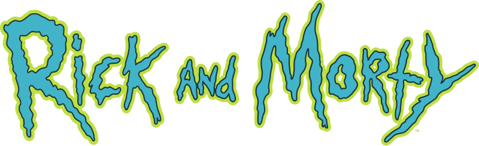

# Multiverse Explorer: Rick and Morty Character Database

## 🚀 Features

### 🔒 Blocking Element

- Mandatory name/job title entry
- Local storage/context persistence
- Update/delete details capability

### 🌌 Character Exploration

- Paginated character grid (20/page)
- Detailed character modals with:
  - Status indicators (Alive/Dead/Unknown)
  - Species & origin details
  - Episode appearances
  - High-res character images

### 🎨 Premium UX

- Responsive grid (1-5 columns)
- Chakra UI components + custom theme
- Page transition animations
- and many more

## ⚡ Technologies

- **Frontend**: Next.js 14 (App Router), React 18
- **State Management**: Context API, LocalStorage
- **UI Library**: Chakra UI v3
- **Animation**: Framer Motion
- **Data Fetching**: Apollo Client
- **API**: Rick and Morty GraphQL API - [Try Here](https://rickandmortyapi.com/graphql) - [Documentation](https://rickandmortyapi.com/documentation)

## 📦 Installation

**Clone repository** - git clone https://github.com/nikhileshcr/rick-and-morty-explorer.git

**Install dependencies** - npm install

**Start development server** - npm run dev

## 🙏 Acknowledgments

Data from Rick & Morty API

UI Components by Chakra UI

Icons by React Icons

Animation by Framer Motion
